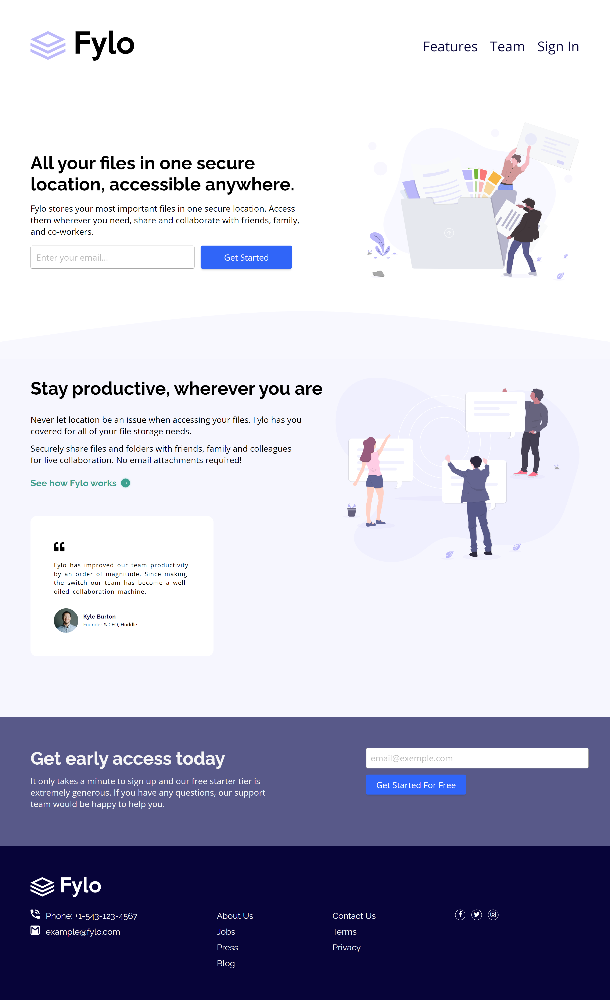

# Frontend Mentor - Fylo landing page with two column layout solution

This is a solution to the [Fylo landing page with two column layout challenge on Frontend Mentor](https://www.frontendmentor.io/challenges/fylo-landing-page-with-two-column-layout-5ca5ef041e82137ec91a50f5).

Frontend Mentor challenges help you improve your coding skills by building realistic projects.

## Table of contents

- [Frontend Mentor - Fylo landing page with two column layout solution](#frontend-mentor---fylo-landing-page-with-two-column-layout-solution)
  - [Table of contents](#table-of-contents)
  - [Overview](#overview)
    - [The challenge](#the-challenge)
    - [Screenshot](#screenshot)
    - [Links](#links)
  - [My Process](#my-process)
    - [Built With](#built-with)
    - [What I Learned](#what-i-learned)
  - [Author](#author)

## Overview

### The challenge

Users should be able to:

- View the optimal layout for the site depending on their device's screen size
- See hover states for all interactive elements on the page

### Screenshot

Desktop:

Mobile:

### Links

- [Live Demo](https://wess-mhhw.github.io/fylo-landing-page-with-two-column-layout/)

## My Process

### Built With

- Semantic HTML5 markup
- CSS custom properties
- Flexbox

### What I Learned

Through this challenge, I was able to:

- **Deepen my understanding of Flexbox:** By taking on this project, I delved deeper into Flexbox's capabilities, going beyond the basics and exploring its finer nuances.
- **Compare Flexbox to Grid:** The challenge presented an opportunity to contrast Flexbox with its counterpart, Grid. This comparative analysis helped me understand the strengths and weaknesses of each layout system, equipping me to choose the right tool for the job in future projects.
- **Master CSS functions:** Specifically, I focused on the clamp() function, learning how to manipulate its parameters to achieve precise and responsive design elements.
- **Handle pseudo-classes and elements:** The project provided a platform to experiment with pseudo-classes and elements, improving my ability to control the appearance and behavior of specific elements based on context and user interaction.

Overall, this project pushed me to actively research and implement new techniques. It wasn't just about completing a task but also about expanding my skillset and learning valuable lessons along the way.

## Author

- Frontend Mentor - [@wess-MHHW](https://www.frontendmentor.io/profile/wess-MHHW)
- LeetCode - [@wess-MHHW](https://leetcode.com/wess-MHHW/)
- Linkedin - [@wassim-maaoui](https://www.linkedin.com/in/wassim-maaoui/)
